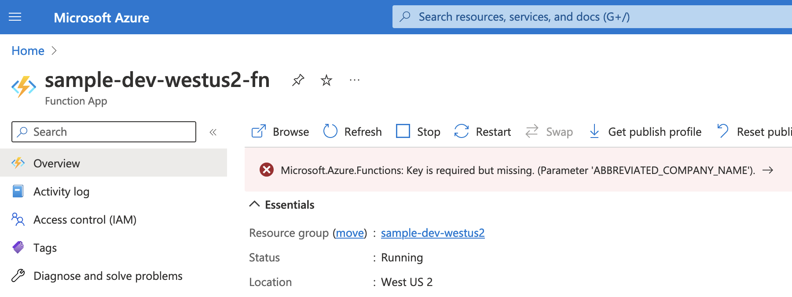

# Messaging Framework  <!-- omit in toc -->

Messaging Framework provides utils to remove common boilerplate code when integrating an Azure Function and an Azure Messaging Service
(for EventHub).

Features supported:

1. Auto-discovers the dependencies your Azure Function requires and registers them into Microsoft dependency injection framework.
1. Parses [EventData body](https://learn.microsoft.com/en-us/dotnet/api/azure.messaging.eventhubs.eventdata?view=azure-dotnet) into a strong type object.
1. Provides base function classes to resolve the event type supported.
1. Provides event handlers interfaces to process the event.
1. Event schema versioning.
1. Sends events to multiple event hubs.

## Get Started

### Basic Setup

1. Create an event class derived from `IntegrationEvent` class.

    ```c#
    public class StreamingDataChanged : IntegrationEvent
    {
        public string MachineId { get; set; }
        public double Temperature { get; set; }
        public double Humidity { get; set; }
    }
    ```

1. Create an Azure Function class derived from `BasicFunctionAsync` or `BasicFunctionWithReturn<TReturn>`.
Also, you can specify the default integration event to process.

    ```c#
    public class StreamingDataChangedFunction : BasicFunctionAsync
    {
        public StreamingDataChangedFunction(
            IServiceProvider serviceProvider,
            ILoggerFactory loggerFactory)
            : base(serviceProvider, loggerFactory.CreateLogger<StreamingDataChangedFunction>())
        {
        }

        public async Task Run([EventHubTrigger("%EVENT_HUB_NAME%", Connection = "EVENT_HUB_CONNECTION_STRING")] EventData eventData)
        {
            await this.RunFunctionAsync(eventData);
        }

        protected override Type? GetDefaultIntegrationEvent()
        {
            return typeof(Models.EventHubs.Events.V1.StreamingDataChanged);
        }
    }
    ```

1. Create an EventHandler class derived from `IIntegrationEventHandlerAsync<TIntegrationEvent>` or
`IIntegrationEventHandlerWithReturnAsync<TIntegrationEvent, TReturn>`. In addition, implement the `Handle` method
to add the event processor business logic.

    ```c#
    [DependencyInjection(Extends = typeof(IIntegrationEventHandlerAsync<StreamingDataChanged>), ServiceType = ServiceLifetime.Scoped)]
    public class StreamingDataChangedEventHandlerAsync : IIntegrationEventHandlerAsync<StreamingDataChanged>
    {
        public async Task Handle(StreamingDataChanged eventData)
        {
            // add business logic...
        }
    }
    ```

    Observe that the event is already parsed and transformed from `EventData`.

1. Create a `Startup` class, import the `Microsoft.Azure.Functions.StreamingDataFlow.Extensions` extensions and call the `RegisterServices()` method
to scan and register the services across the multiple libraries.

    ```c#
    using Microsoft.Azure.Functions.StreamingDataFlow.Extensions;

    public class Startup : FunctionsStartup
    {
        public override void Configure(IFunctionsHostBuilder builder)
        {
            builder.Services.RegisterServices(builder.GetContext().Configuration);
        }
    }
    ```

### Enable Settings object as Dependency Service

Refer to [enable settings object as dependency injection document](./docs/enable-settings-object-as-di.md).

### Event Schema Versioning

Refer to [event schema versioning document](./docs/event-schema-versioning.md).

### Send Multiple Event Types to the Same Event Hub

Refer to [send multiple event types to the same event hub](./docs/multiple-event-types-to-same-event-hub.md).

## Components for consumers

### Attributes

| Class      | Description |
| ----------- | ----------- |
| `DependencyInjectionAttribute` | Attribute to register services into the [IoC container](https://martinfowler.com/articles/injection.html). When bootstrapping the function app, it will discover the classes that contains this attribute across multiple libraries. |

The `DependencyInjectionAttribute` decorator has the following properties:

| Property      | DataType | Required | Description |
| ----------- | ----------- | ----------- | ----------- |
| `Extends` | [Type class](https://learn.microsoft.com/en-us/dotnet/api/system.type?view=net-7.0) | No | Type class that is registered in the Microsoft [IoC container](https://martinfowler.com/articles/injection.html). If null, it defaults to the base type class where the decorator is set. For example, if the class definition is `class Foo : Bar`, it will be registered as `Bar` type. |
| `ServiceType` | [ServiceLifetime enum](https://learn.microsoft.com/en-us/dotnet/api/microsoft.extensions.dependencyinjection.servicelifetime?view=dotnet-plat-ext-7.0) | Yes | Specifies the lifetime of a service in an [IServiceCollection](https://learn.microsoft.com/en-us/dotnet/api/microsoft.extensions.dependencyinjection.iservicecollection?view=dotnet-plat-ext-7.0). |

### Event Handlers

| Class      | Description |
| ----------- | ----------- |
| `IIntegrationEventHandlerAsync` | An interface for an integration event handler which can handle an integration event asynchronously. |
| `IIntegrationEventHandlerWithReturnAsync` | An integration event handle which can handle an integration event asynchronously and return a value. |

### Function

| Class      | Description |
| ----------- | ----------- |
| `BasicFunction` | Abstract class for basic Azure function. It tracks fields: `trace_id` for traceability, `event_type` for identitying the type of event to transform. |
| `BasicFunctionAsync` | Implementation class inherited from `BasicFunction`. It does not return any data. |
| `BasicFunctionsWithReturnAsync` |  Implementation class inherited from `BasicFunction`. It returns data.|

### Extensions

| Class      | Description |
| ----------- | ----------- |
| `ServiceExtensions` | Provides [IServiceCollection](https://learn.microsoft.com/en-us/dotnet/api/microsoft.extensions.dependencyinjection.iservicecollection?view=dotnet-plat-ext-7.0) extension methods to register the services that are decorated with `DependencyInjectionAttribute`. |

### Interfaces

| Class      | Description |
| ----------- | ----------- |
| `IAdapter` | General interface for any type of data conversion. |

### Utils

| Class      | Description |
| ----------- | ----------- |
| `Guard` | Safeguard util to ensure parameters are in compliance. |

An instance of this is validating the function app settings are not null during runtime. Observe the property `ABBREVIATED_COMPANY_NAME`:

```c#
public class StreamingDataFlowSettings : IStreamingDataFlowSettings
{
    public StreamingDataFlowSettings(IConfiguration config)
    {
        this.EventHubName1 = config.GetValue<string>("EVENT_HUB_NAME1");
        this.EventHubName2 = config.GetValue<string>("EVENT_HUB_NAME2");
        this.AbbreviatedCompanyName = config.GetValue<string>("ABBREVIATED_COMPANY_NAME");

        Guard.ThrowIfNull("EVENT_HUB_NAME1", this.EventHubName1);
        Guard.ThrowIfNull("EVENT_HUB_NAME2", this.EventHubName2);
        Guard.ThrowIfNull("ABBREVIATED_COMPANY_NAME", this.AbbreviatedCompanyName);
    }

    ...
}
```

Behavior when running on Azure Portal:



## Source Code

Refer to [source projects document](./src/README.md).

## Tests

Refer to [test projects and framework document](./tests/README.md).

## Tooling

Refer to [tool projects document](./tools/README.md).
