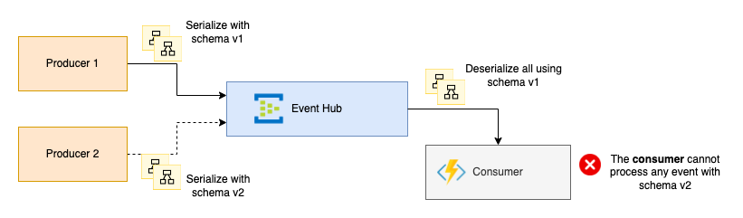

# Event Schema Versioning

## Overview

The complexity and frequency of schema changes are usually overestimated and we need to add
more information or modify the definition for a better developer experience.



In Figure 1, Producer 2 is a new producer that emits events with schema v2. The problem is, the
consumer only understands events with schema v1. Hence, it will fail to process such events since
the events versions are not backward compatible.

In this scenario, event schema versioning is required and this framework has utilities to achieve it.

## Add new event schema version

1. In `Microsoft.Azure.Models` project, add a new event version directory (i.e. `EventHubs/Events/V2`).

1. Add the new event version schema class. Make sure to specify a relevant namespace, for example,
`Microsoft.Azure.Models.EventHubs.Events.V2`.

1. Now that there are two or more event schemas, we need to indicate to the consumer what event schema to
use when deserializing. To do this, specify the property `EventType` from the event in the producer side:

    ```c#
    var eventData = new EventData(myEventPayload);
    eventData.Properties.Add("EventType", "Microsoft.Azure.Models.EventHubs.Events.V2.StreamingDataChanged"); // or use typeof keyword referencing the new class name (of v2)
    ```

## Specify fallback event schema version

If the property `EventType` from the event is not set, the consumer will fallback to the schema specified in
the function (derived from `BasicFunction`).

You can override the method `GetDefaultIntegrationEvent` and set the default type.

```c#
        protected virtual Type? GetDefaultIntegrationEvent()
        {
            return typeof(Microsoft.Azure.Models.EventHubs.Events.V1.StreamingDataChanged);
        }
```
