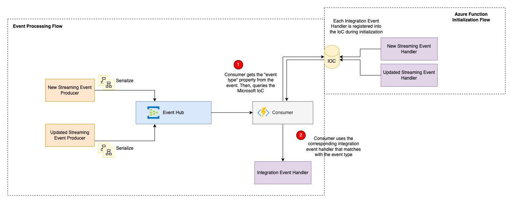

# Send Multiple Event Types in the Same Event Hub

## Overview



This is an scenario where multiple event types have to be allocated to the same Event Hub & processed by the same
Azure Function. This framework figures the corresponding event handler based on the event type. This means, the
developer does not have to worry about deserializing the event data based on the event type. Also, each event
type will have its own processing implementation independent of each other.

## Set Event Type Property (Producer)

1. For each event, add the event type as part of the event's metadata.

    ```c#
    // In Producer 1
    var eventData = new EventData(myEventPayload);
    eventData.Properties.Add("EventType", "Microsoft.Azure.Models.EventHubs.Events.V1.NewStreamingDataChanged"); // or use typeof keyword referencing the new class name
    ```

    ```c#
    // In Producer 2
    var eventData = new EventData(myEventPayload);
    eventData.Properties.Add("EventType", "Microsoft.Azure.Models.EventHubs.Events.V1.UpdateStreamingDataChanged"); // or use typeof keyword referencing the new class name
    ```

## Register Event Handlers per Event Type (Consumer)

1. Register each integration event handler into the Microsoft IoC. For instance, based on the above's figure, we need register two  event handlers.

    ```c#
        [DependencyInjection(Extends = typeof(IIntegrationEventHandlerAsync<NewStreamingDataChanged>), ServiceType = ServiceLifetime.Scoped)]
        public class NewStreamingDataChangedEventHandlerAsync : IIntegrationEventHandlerAsync<NewStreamingDataChanged>
        {
            public async Task Handle(NewStreamingDataChanged eventData)
            {
                // add business logic...
            }
        }
    ```

    ```c#
        [DependencyInjection(Extends = typeof(IIntegrationEventHandlerAsync<UpdatedStreamingDataChanged>), ServiceType = ServiceLifetime.Scoped)]
        public class UpdatedStreamingDataChangedEventHandlerAsync : IIntegrationEventHandlerAsync<UpdatedStreamingDataChanged>
        {
            public async Task Handle(UpdatedStreamingDataChanged eventData)
            {
                // add business logic...
            }
        }
    ```

    Now, when an event is being processed by the function, this is what happens behind the scenes:

    - It determines the event type
    - It queries the Microsoft IoC and verifies if the event handler matches with the event type
    - If yes, event will be processed by its corresponding event handler. Otherwise, event is discarded.

    See more details in [EventDataExtensions class](../src/Microsoft.Azure.Functions/Eventhubs/Extensions/EventDataExtensions.cs).
